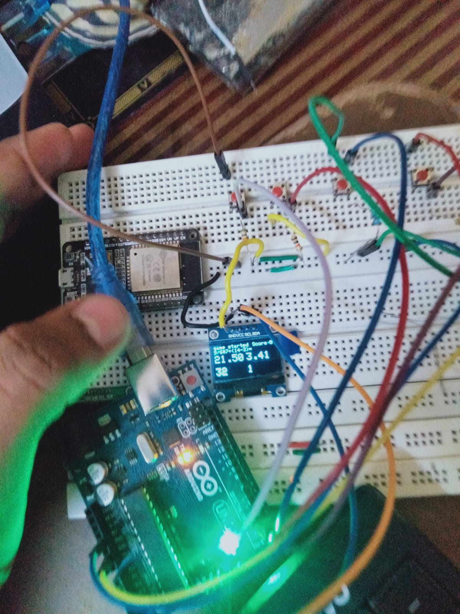

# quiz_on_oled_arduino
 <h1>This Rep is about Quiz game on Oled used Arduino</h1>
    <h2>NOTE:This code can be used on all MCU's which are supported by Arduino IDE</h2>
    
This is a kind of GUI(Graphical user interface) project
  
    <h3>Steps:</h3>
    <ul>
        <li>Install the Arduino IDE from this website <a href="https://www.arduino.cc/en/software">Arduino IDE</a></li>
        <li>Then Download the libraries that are mentioned in the folder <a href="https://github.com/tejartr7/quiz_on_oled_arduino/tree/main/libraires">Click here</a></li>
        <li>Then make the cicuit as shown below</li>
        <h1>Circuit image</h1>
        
        <li>Then upload the code</li>
    </ul>
    <h1>There are the outcomes of my project</h1>
    

        

            
            <video width="320" height="240" autoplay>
                <source src="media/video.mp4" type="video/mp4">
              Your browser does not support the video tag.
              </video>
        

    

